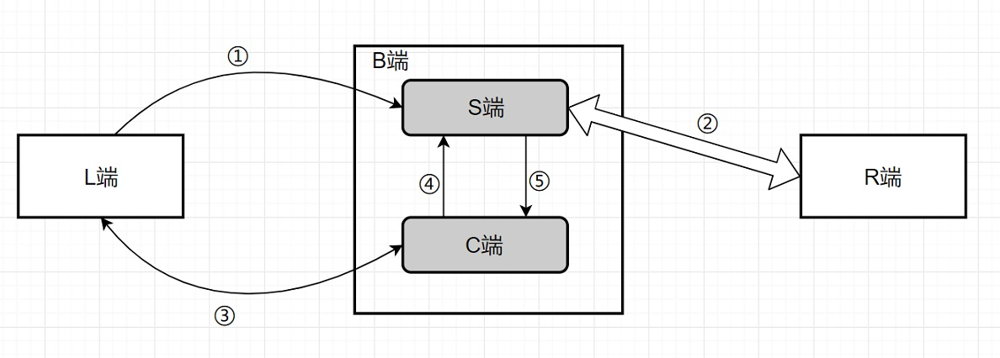

# Proxy

 目的：在国外Free的PHP空间上搭建数据转发程序

## 版本

* HTTP(php) —— 通过网页直接访问
* SOCKS5 —— Python客户端 + php远端 方式传输
    * Unix版 —— 最优版本，在支持Unix协议的服务器上使用
    * TCP版 —— 在支持TCP协议的服务器上使用
    * 文件版 —— 在不支持以上协议的服务器上使用，效率较低

## SSL Over HTTPS 示意图

[img]:

 * L端 —— 本地Python Socks5程序
 * B端 —— 中间PHP服务器
    * S端 —— 用来与R端维持②链接
    * C端 —— 用来在L端与S端之间建立关系通道(Unix/TCP/文件方式)
 * R端 —— 远端服务器

**Why:**  
如果我们直接L——B——R，不分S和C的话，就只支持HTTP，而不支持HTTPS的代理。  
换句话说，HTTP是无状态的协议，再此基础上只能传输只需要一个来回的协议数据；而一个完整的HTTPS数据流需要传输三个来回的协议数据。

所以我们需要在B端分S和C端，使S与R建立一条正常的TCP链接，在L与C端传递数据时，②链路不会随意中断。保证会话的完整性，上下文一致。C端每次都是新的进程，但S端要维持整个会话。

## 使用说明

见脚本的注释

## 使用建议

建议经过国内的数据通过HTTPS加密，HTTP会泄漏访问的远端域名信息。

## Tips

1. 找一个国外PHP空间
2. 优先选择支持Unix的版本
3. 配置好参数
4. 如果空间不支持HTTPS，找个支持HTTPS的国外CDN
5. ^_^